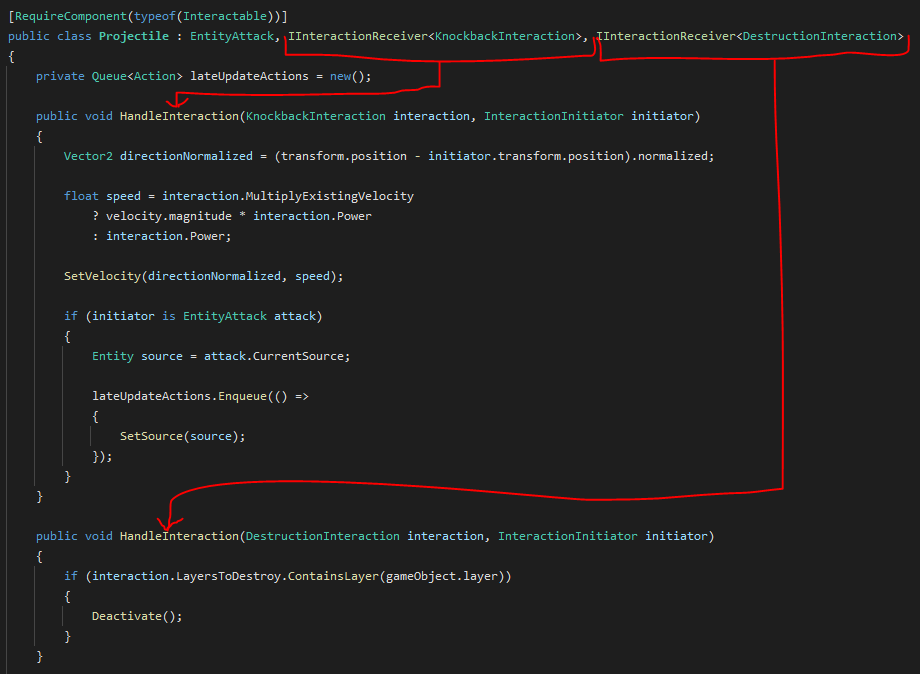

# About project
This project is meant to be a base for a 2D top-down game with a combat system.

It provides basic functionalities that can be extended based on specific needs. The code and project structure was made with emphasis on scalability, reusability and readability.

# Architecture
The project was made with an assumption that everything in the game is an **Entity** that is made of **Entity Behaviours** that execute actions based on **Entity Actions**.
This way it is possible to create a lot of reusable code that is easy to manage. For example, both player and turret use the same [Combat class](https://github.com/Apo100u/TLH/blob/master/Assets/Scripts/Gameplay/Entities/Behaviours/Combat/Combat.cs) to fire projectiles.

# Key features
### State machine
* The projects contains a [StateMachine class](Assets/Scripts/Utility/StateMachine/StateMachine.cs) that works with abstract states.
* Any functionality that needs to be a state machine can reuse this class with the implementation of own states and transitions between them.
* Example use can be found in the [Movement class](Assets/Scripts/Gameplay/Entities/Behaviours/Movement/Movement.cs).

### Interaction System
* The project contains [interaction interfaces](Assets/Scripts/Gameplay/Interactions) and [interaction types](Assets/Scripts/Gameplay/Interactions/Types).
* This allows to add interactions to classes in an organized way by simply implementing an interface with needed interaction type.
* Example use can be found in the [Projectile class](Assets/Scripts/Gameplay/Entities/Attacks/Projectile.cs).

### Scriptable objects
* Entities in the game perform actions (like MeleeAttack, Dash, etc) based on scriptable objects, where all gameplay parameters are exposed.
* Once a functionality that uses SO is programmed, it is easily possible to create multiple variations of it without the need to modify code.

